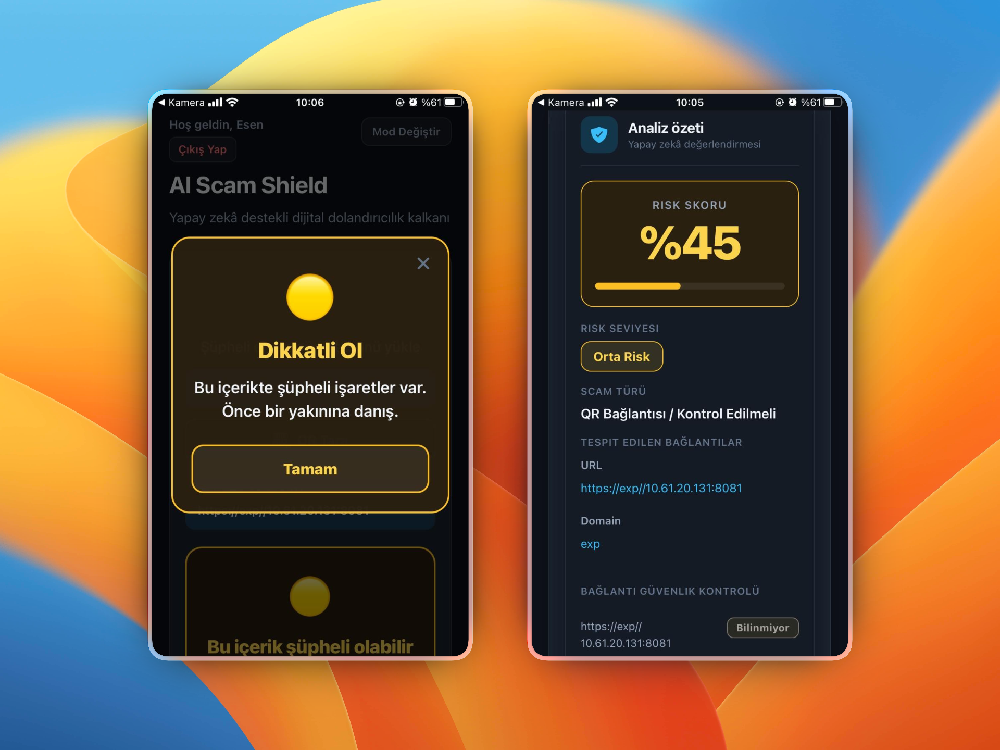
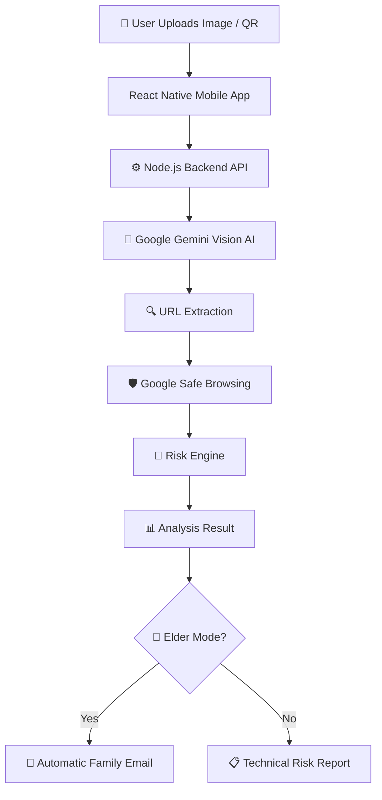
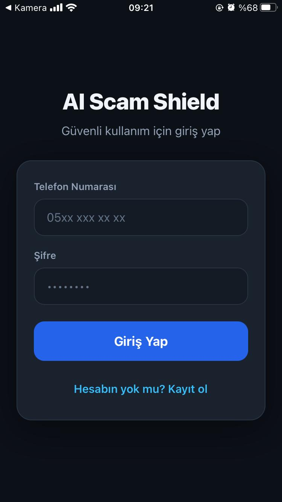
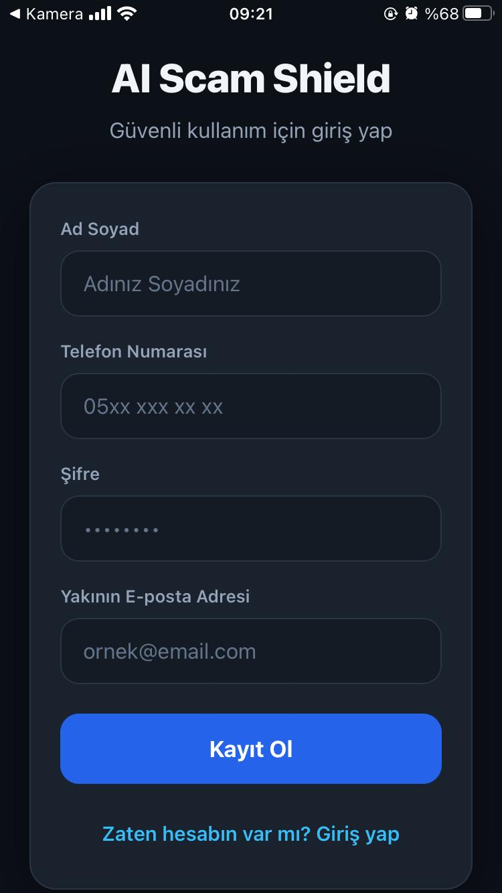
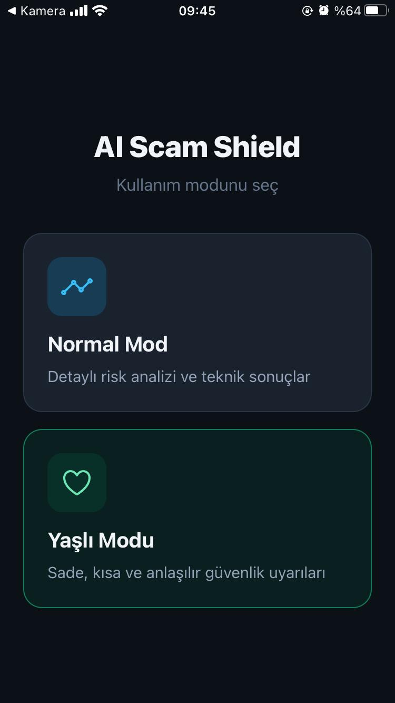
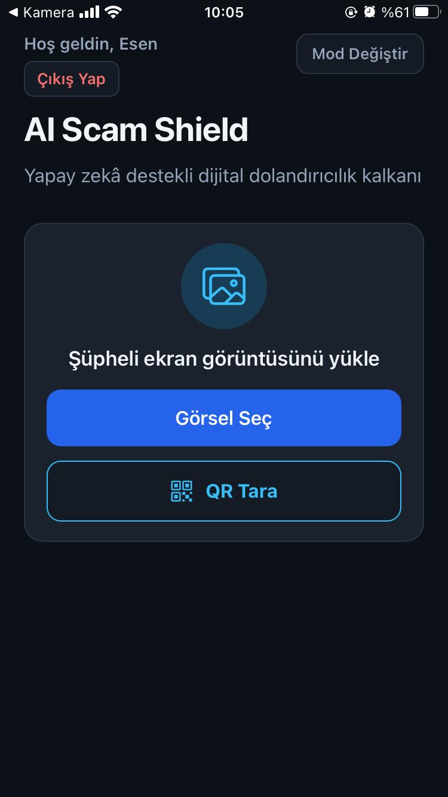
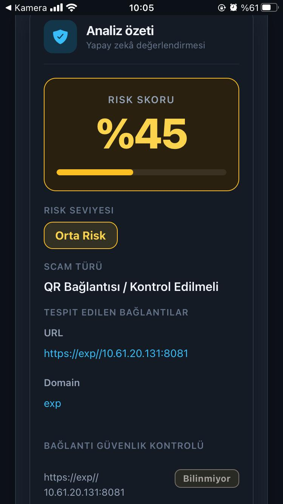
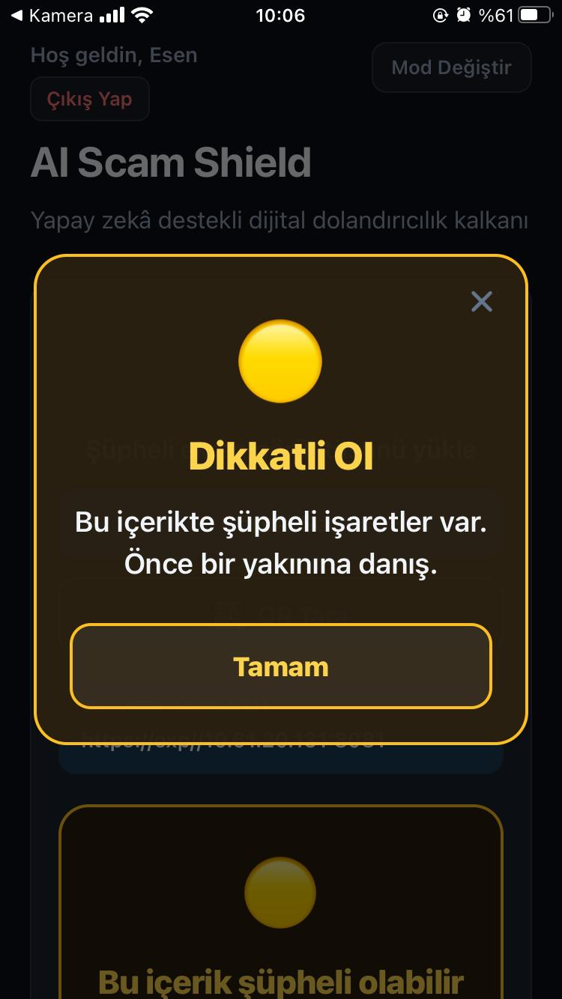
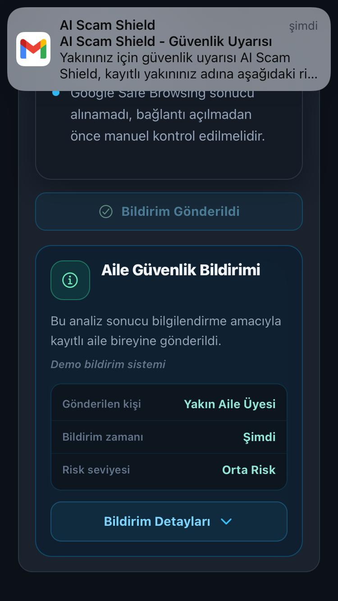

> ⚠️ This repository is a modified and renamed version of the original project:  
> [ai_destekli_satis_asistani](https://github.com/nefisegll/ai_destekli_satis_asistani.git)

<div align="center">



<br />
<br />

# 🛡️ AI Scam Shield

### AI-powered digital scam detection system for vulnerable users

AI Scam Shield is an AI-assisted cybersecurity mobile application developed for **BTK Hackathon 2026**.

It helps users detect phishing attempts, malicious QR codes, fake payment pages, scam SMS messages, and suspicious links using **Google Gemini Vision AI** and **Google Safe Browsing**.

Designed especially for elderly and non-technical users, the system can automatically notify family members in high-risk situations.

<br />


<br />
<br />

[🎥 Demo Video](#) • [📱 Screenshots](#-screenshots) • [🏗️ Architecture](#️-system-architecture--workflow)

</div>

---

# ✨ Why AI Scam Shield?

Digital scams are becoming increasingly sophisticated with AI-generated phishing attacks, fake QR codes, malicious payment pages, and impersonation attempts.

Many users — especially elderly individuals — struggle to recognize these threats before becoming victims.

AI Scam Shield was developed to provide:

- 🧠 AI-powered scam detection
- 🛡️ Real-time URL threat analysis
- 👵 Elder-friendly protection mode
- 🚨 Automatic family alert system
- 📱 Mobile-first cybersecurity assistance

---

# 🚀 Features

## 📸 AI Image & Screenshot Analysis

Users can upload:

- phishing SMS screenshots
- suspicious e-mails
- fake payment pages
- scam advertisements
- banking/payment screenshots

Google Gemini Vision AI analyzes the content and returns:

- risk score
- scam type
- risk explanation
- detected phishing patterns

---

## 🔍 QR Code Scam Detection

The application can:

- scan QR codes in real time
- extract hidden URLs
- analyze suspicious redirects
- check malicious links using Google Safe Browsing

---

## 👵 Elder Mode

Specially designed for elderly and non-technical users.

Instead of technical details, the app shows:

- large warning cards
- simplified danger explanations
- easy-to-understand security messages

Example:

> “This link may be dangerous. Please do not open it.”

---

## 🚨 Automatic Family Alerts

When Elder Mode is active and a high-risk scam is detected:

- the system automatically sends an alert email
- family members are notified instantly
- scam details and risk score are included

This creates a real-time protection layer for vulnerable users.

---

## 🧠 Smart Risk Engine

Risk analysis combines:

- Gemini Vision AI analysis
- phishing keyword detection
- urgency language analysis
- password/payment request detection
- malicious URL verification
- Safe Browsing threat intelligence
- trusted domain filtering

This hybrid structure helps reduce false positives.

---

# 🏗️ System Architecture & Workflow



---

# 📱 Screenshots

## Authentication & User System

<table align="center">
<tr>

<td align="center">

<br />
<b>Login Screen</b>
</td>

<td align="center">

<br />
<b>Register Screen</b>
</td>

<td align="center">

<br />
<b>Mode Selection</b>
</td>

</tr>
</table>

---

## Scam Analysis Experience

<table align="center">
<tr>

<td align="center">

<br />
<b>QR / Image Selection</b>
</td>

<td align="center">

<br />
<b>Technical Risk Analysis</b>
</td>

<td align="center">

<br />
<b>Elder Warning Mode</b>
</td>

</tr>
</table>

---

## Family Alert System

<table align="center">
<tr>

<td align="center">

<br />
<b>Automatic Family Alert</b>
</td>

</tr>
</table>

---

# 🛠️ Tech Stack

## Frontend / Mobile

- React Native
- Expo
- TypeScript

## Backend

- Node.js
- Express.js
- TypeScript

## AI & Security

- Google Gemini Vision API
- Google Safe Browsing API

## Authentication & Storage

- AsyncStorage
- Local session persistence

## Notification System

- Nodemailer
- Gmail SMTP

---

# ⚙️ Backend Endpoints

| Method | Endpoint | Description |
|---|---|---|
| POST | `/api/analyze` | Analyze uploaded image |
| POST | `/api/analyze-qr` | Analyze QR code |
| POST | `/api/notify-family` | Send family alert |
| GET | `/api/test-mail` | Test mail service |
| GET | `/health` | Health check |

---

# 📦 Installation & Run

## Backend

```bash
cd backend
npm install
npm run dev
```

Backend runs on:

```bash
http://localhost:5000
```

---

## Mobile App

```bash
cd mobile
npm install
npm start
```

Then:

- scan the QR code using Expo Go
- or press `a` for Android emulator

---

# 🔐 Environment Variables

Create a `.env` file inside the backend directory:

```env
GEMINI_API_KEY=your_gemini_api_key

PORT=5000

SMTP_HOST=smtp.gmail.com
SMTP_PORT=587
SMTP_USER=your_email@gmail.com
SMTP_PASS=your_app_password

SMTP_FROM_NAME=AI Scam Shield
SMTP_SECURE=false
```

---

# 🌟 Future Improvements

- SMS text analysis
- Voice scam detection
- Browser extension support
- Real-time call protection
- Turkish banking integrations
- AI-generated scam explanation assistant
- Cloud database support
- Multi-language support

---

# 🎯 BTK Hackathon 2026

This project was developed for:

### BTK Akademi Hackathon 2026

Theme focus:

- AI
- Cybersecurity
- Digital Safety
- Social Impact
- Elderly Protection

---

# 👥 Team

AI Scam Shield Team

Built with ❤️ for safer digital experiences.
